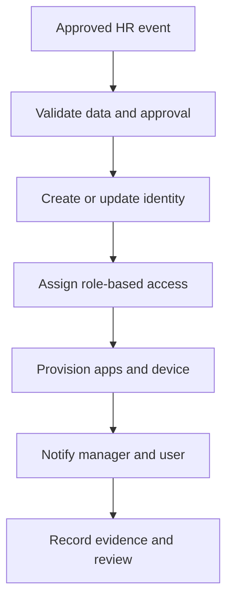

# Identity Lifecycle Automation

A governance-first design for automating employee joiner, mover, and leaver processes across HR, identity, applications, devices, approvals, notifications, and audit records.

## Scenario

SaaBerr Technology Lab is a fictional 150-user organization. HR is the authoritative source for employee status. Microsoft Entra ID represents the identity platform, but the design can be adapted to Okta or another provider.

## Objectives

- Create access accurately and on time.
- Adjust access when responsibilities change.
- Revoke access quickly and verifiably.
- Use role-based access and least privilege.
- Preserve approvals, evidence, and exception records.
- Notify managers and system owners automatically.

## Workflow

## Guide

1. [Architecture](docs/01-architecture.md)
2. [Joiner workflow](docs/02-joiner.md)
3. [Mover workflow](docs/03-mover.md)
4. [Leaver workflow](docs/04-leaver.md)
5. [Role-based access](docs/05-role-based-access.md)
6. [Controls and exceptions](docs/06-controls-exceptions.md)
7. [Testing and metrics](docs/07-testing-metrics.md)

## Design Principle

Automation should fail safely. A malformed HR record must not silently create excessive access, and failed deprovisioning must generate a high-priority alert with a named owner.

## Author

Eduardo Saavedra Berrocal  
Founder & Principal Technology Advisor  
SaaBerr Technology Solutions

